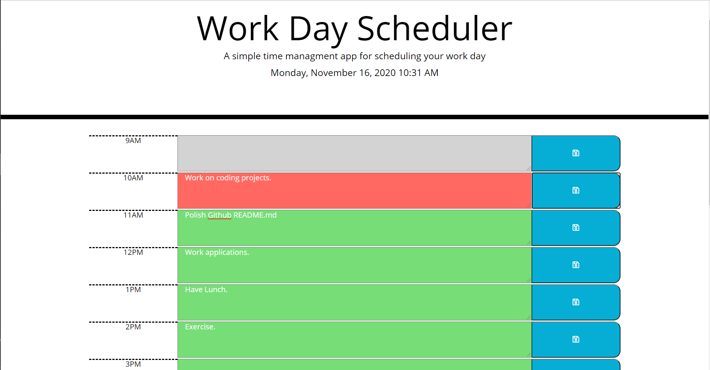

# Workday-Planner

    <h4>
    </a>
    
    
        
    </h4>

 

This is a daily planner application.

  <h4>
    <a href="https://github.com/ThomasMullaney/Workday-Planner">
      Github Repository
    </a>
 | 
<a href=" https://thomasmullaney.github.io/Workday-Planner/">
      Github Pages
    </a>
  </h4>

## Description:
### A time managment daily planner application.

## Table of Contents:
     
1. [Installation](#installation)
2. [Usage](#usage)
3. [License](#license)
4. [Contributing](#contributing)
5. [Tests](#tests)
6. [Questions](#questions) 

## Installation: 
### Open index.html in browser to open locally. 

## Usage:
### App helps users manage their time more efficently. Save events into local storage by clicking the save icon for each corresponding hour. Saved events with persist through page refresh.

## License:
### 
    
## Contributing:
### Tom Mullaney

## Tests:
### 

    
## Questions:
### github.com/ThomasMullaney
### tloring.mullaney@gmail.com
    
